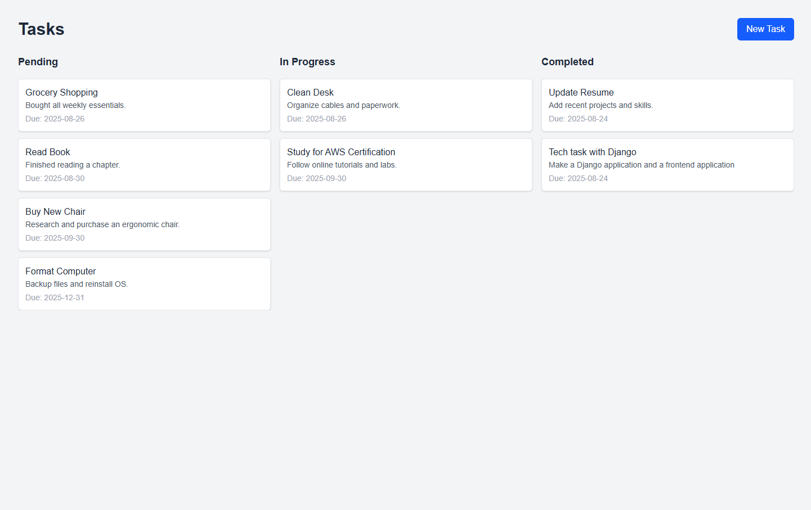

# tasks-tech-challenge
Repo with backend and frontend services for a technical challenge

# Submited by
Name: Felipe Carvalho

# Main instructions

This repository contains both the backend and frontend projects. Open two terminals to run both projects.

* `backend` directory: includes the Django project with Docker;
* `frontend` directory: includes a NextJS project that consumes the Django RestAPI;

You can find bellow the specific structions to run each project.

### Important

Because this is a test (not a real project) developed with limited time, important points of software development were not covered in this repository and projects, eg:

* Git branchs strategies (all commits were pushed direct to `main` branch);
* Pipeline implementation;
* The use of UUID or soft delete in the Django models;
* The ability to update or delete tasks via the user interface;
* The ability to log out via the user interface;

# backend

This a Django project running with Python 3.12 and Postgres database.

The project is in the `server` directory and it has apps: `user_profiles` and `tasks`. Common files and configurations files are in the `core` directory.

## Deployment

### Prerequisites

Prerequisites:
- Docker installed
- Docker Compose installed

### Installation Steps

Configure the enviroments variables

> cp .env.local .env

Build and start containers
> docker-compose up --build

The server will be running in [http://localhost](http://localhost)

Additional Docker Commands
- Stop containers: `docker-compose down`
- View logs: `docker-compose logs`
- Run specific commands: `docker-compose exec web <command>`

#### Running tests
- Run tests: `docker-compose exec web python manage.py test`

# frontend

This a NextJS project. NextJS was choosen due:

- Server-Side Rendering (SSR): Delivers pages faster and improves SEO by rendering content on the server.
- File-based Routing: Easy-to-manage routing system with automatic code splitting.
- React Ecosystem: Full compatibility with React features and libraries.
- Scalability: Handles both small and large projects efficiently with hybrid rendering options.
- Strong Community & Support: Wide adoption, frequent updates, and extensive documentation.

The application contains only three pages
- `/` -> it is the login page
- `/signup` -> it is the signup page
- `/home` -> it is the page with the Task Board

## Deployment

### Prerequisites

- Node.js (v18 or later recommended)
- npm
- Git

### Installation Steps

Using npm, install the dependencies

> npm intall

Configure the enviroments variables

> cp .env.local .env

Build the app

> npm run build

Then start

> npm start

Open the app in yout browser in [http://localhost:3000](http://localhost:3000)
